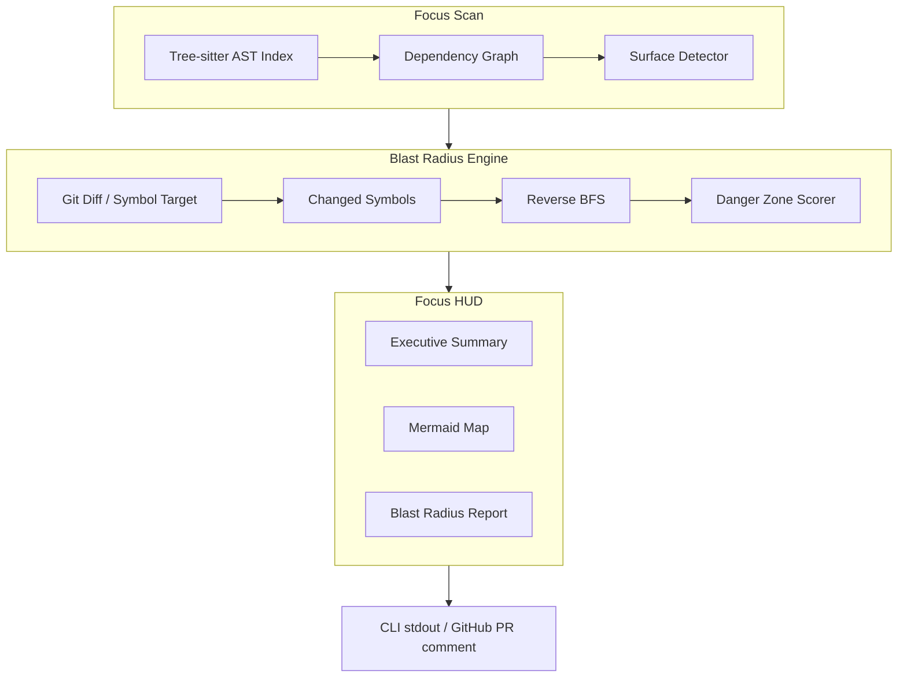

# Focus

Focus answers one question before you merge: **what else in this codebase could break because of this change?**

It's an **AR HUD for codebases**: it maps how the pieces of a repository connect — imports, calls, API routes, schemas — and shows the blast radius of a change before it merges.

> **Status:** Phase 3 complete — evidence-based blast radius (Python + JS/TS), GitHub Action, parse cache. No LLM labels. See [`docs/ROADMAP.md`](docs/ROADMAP.md).

---

## Why this exists

There's a new kind of pressure on developers — and it lands hardest on juniors: walk into a codebase you've never seen, point an AI at it, and ship. Developers used to build a mental map of a system by debugging it the old-fashioned way: tracing calls, breaking things, fixing them. That process has been compressed into a prompt. The code now arrives in seconds. The understanding doesn't.

Focus exists for the moment right before you commit and push to a codebase that was there long before you. It shows two things, with evidence: **what the system looks like right now, and what your proposed change will actually touch** — who imports this function, which API routes break, which schemas drift. That's the difference between "the AI wrote it and it seems fine" and "I checked — here's the map." Confidence you can defend in review, whether you're a junior shipping your first AI-assisted PR or a senior reviewing your tenth one today. And the stakes are real: catching a missed dependency before merge costs minutes; catching it after costs the week.

Existing tools dump 1,000-word summaries onto PRs. Focus replaces text walls with **evidence-based visual clarity**:

- **Focus Scan** — Tree-sitter parses the full repo and maps structural nodes (imports, calls, routes, schemas).
- **Blast Radius Engine** — Simulates ripple effects of a proposed change; highlights Danger Zones before merge.
- **Focus HUD** — Executive summary + Mermaid dependency map + bulleted blast radius report.

---

## When you'd use it

| The moment | What you'd do | What you get |
|---|---|---|
| Your AI assistant just rewrote a shared function | `focus audit --local` before you push | The blast radius of your working tree vs `main` — before anyone else sees the PR |
| An 800-line AI-generated PR lands in your review queue | Read the Focus HUD on the PR | A skim-or-dig decision in one glance: diagram + Danger Zones, or a one-line "low impact" |
| You inherited a module and need to change it | `focus trace path/to/file.py` | Everything that depends on that file, before you touch it |
| You're renaming or moving a shared utility | `focus trace`, then `focus audit --local` | Every consumer of that symbol, so the refactor surprises no one |
| A migration or API route changes | `focus audit` on the branch | Which parts of the app actually reach that schema or endpoint |

Commands: `scan`, `trace`, and `audit` work today; PRs get a Focus HUD comment via the shipped GitHub Action. Walkthrough + saved HUDs: [`docs/DEMO.md`](docs/DEMO.md).

---

## Getting started

> Core loop: `focus scan` indexes the repo, `focus trace` prints a Focus HUD, `focus audit --local` checks your working tree before you push.

```bash
git clone https://github.com/j0viane/focus.git
cd focus
uv sync            # or: pip install -e .
uv run focus --help
uv run focus scan .
uv run focus trace src/focus/models.py
uv run focus audit --local
uv run focus audit --local --out focus-hud.md
```

**Try the demo fixtures** (good for screenshots):

```bash
uv run focus trace tests/fixtures/glass_box/auth_utils.py --root tests/fixtures/glass_box --out focus-hud.md
```

Open `focus-hud.md` in Markdown preview to see Mermaid. More examples: [`docs/DEMO.md`](docs/DEMO.md).

`focus audit --local` diffs your working tree against `main` and prints a Focus HUD.  
`--out focus-hud.md` also writes that HUD to a file — open it in the editor and use **Markdown preview** to see the Mermaid diagram (works in Cursor and VS Code).

Unchanged files are re-used from a local **`.focus-cache/`** (gitignored). Pass `--no-cache` on `scan` / `trace` / `audit` to force a full re-parse, or delete the folder anytime.

Optional repo config: copy [`.focus.toml.example`](.focus.toml.example) to `.focus.toml` to tune `fan_out_threshold` (default **3** — when a shared hub becomes a Danger Zone).

### GitHub Action (PR comments)

This repo ships [`.github/workflows/focus.yml`](.github/workflows/focus.yml). On pull request open/sync it runs `focus audit` against the PR base and posts (or updates) a Focus HUD comment. Permissions are `contents: read` + `pull-requests: write` only — see [`docs/PRIVACY.md`](docs/PRIVACY.md).

Other repos: copy that workflow file, or install Focus and point the `uv sync` step at your package once published.

Requirements: Python 3.12+, [`uv`](https://docs.astral.sh/uv/) (or `pip`). Tree-sitter grammars arrive with the parser in Phase 1.

Run the tests:

```bash
uv run pytest
```

---

## Why "Focus"?

The name comes from *Horizon Zero Dawn*. The game's world was built by a civilization that is long gone, and it runs on machines no one alive fully understands. Aloy can navigate it because of her **Focus** — a small AR device that scans that inherited world and reveals what the naked eye can't: machine weak points, hidden paths, danger ahead. Intel first, decisions second.

A legacy codebase is the same kind of world — built by people who have moved on, full of machinery nobody fully understands anymore. This Focus scans it and surfaces what a raw diff can't, so you make the change with intel instead of walking in blind.

In other words: Aloy is the junior engineer handed a legacy codebase. The Focus is how she reads it. And fittingly, in the game's lore, the Focus was originally designed to educate the next generation about the world they inherited.

*Horizon Zero Dawn and Aloy belong to Guerrilla Games — no affiliation, just admiration.*

---

## Architecture



| Layer | Technology |
|---|---|
| CLI | Python 3.12+ / Typer |
| AST parsing | Tree-sitter (multi-language grammars) |
| Graph | NetworkX (dependency + blast radius traversal) |
| Diagrams | Mermaid.js (native GitHub rendering) |
| GitHub integration | GitHub Action on PR open/sync |

**Core pipeline:** Full-repo Tree-sitter index → dependency graph → diff/symbol seeds → reverse BFS blast radius → smart triggers (diagram vs summary) → Focus HUD.

See [`.cursor/rules/focus-engineering.mdc`](.cursor/rules/focus-engineering.mdc) for non-negotiable engineering constraints.

---

## Commands

| Command | Purpose | Status |
|---|---|---|
| `focus scan [path]` | Full-repo AST index (Python + JS/TS) | ✅ |
| `focus trace [file]` | Focus HUD for a file: summary, Mermaid map, blast radius | ✅ |
| `focus audit [pr\|branch]` | Pre-merge blast radius for a PR or branch diff | ✅ `focus audit --base <sha>` (PR range) |
| `focus audit --local` | Pre-flight against working tree vs `main` | ✅ |
| `focus version` | Print the installed version | ✅ |

---

## Roadmap (summary)

| Phase | Goal |
|---|---|
| **0** *(complete)* | Stack decisions, HUD schema, trigger rules, learning docs |
| **1** *(complete)* | Python CLI: `focus scan` + `focus trace` with Mermaid HUD |
| **2** *(complete)* | `focus audit --local`, Danger Zone polish, smart triggers |
| **3** *(complete)* | GitHub Action, JS/TS, parse cache — evidence-only HUD (no LLM labels) |

Full detail: [`docs/ROADMAP.md`](docs/ROADMAP.md)

---

## Ethics & privacy

- **Evidence-based** — graph topology is computed from static analysis; Focus does not use an LLM to invent edges or summarize impact
- **Privacy-by-design** — respects `.gitignore`; secrets excluded; no source sent to third-party model APIs
- **No surveillance** — analyzes code structure, not developer identity or velocity
- **Opt-in GitHub Action** — minimum token scope; repos choose to install

| Document | Contents |
|---|---|
| [`docs/DEMO.md`](docs/DEMO.md) | Portfolio walkthrough + saved example HUDs |
| [`docs/HUD.md`](docs/HUD.md) | Frozen HUD output schema (source of truth) |
| [`docs/STACK.md`](docs/STACK.md) | Locked technology choices |
| [`docs/DECISIONS.md`](docs/DECISIONS.md) | Phase 0 resolved questions |
| [`docs/ETHICS.md`](docs/ETHICS.md) | Responsible use, anti-weaponization, LLM ethics |
| [`docs/PRIVACY.md`](docs/PRIVACY.md) | Data boundaries, secrets, LLM payloads, Action permissions |
| [`docs/TRIGGERS.md`](docs/TRIGGERS.md) | Smart triggers — diagram vs pass-through |
| [`docs/TESTING.md`](docs/TESTING.md) | Testing pyramid, golden fixtures, CI constraints |

---

## License

[MIT](LICENSE) © 2026 Joviane Bellegarde. Free to use, modify, and share — keep the copyright notice for credit.

---

## Author

Built by [Joviane Bellegarde](https://github.com/j0viane). Feedback and architecture review tips welcome via Issues.
