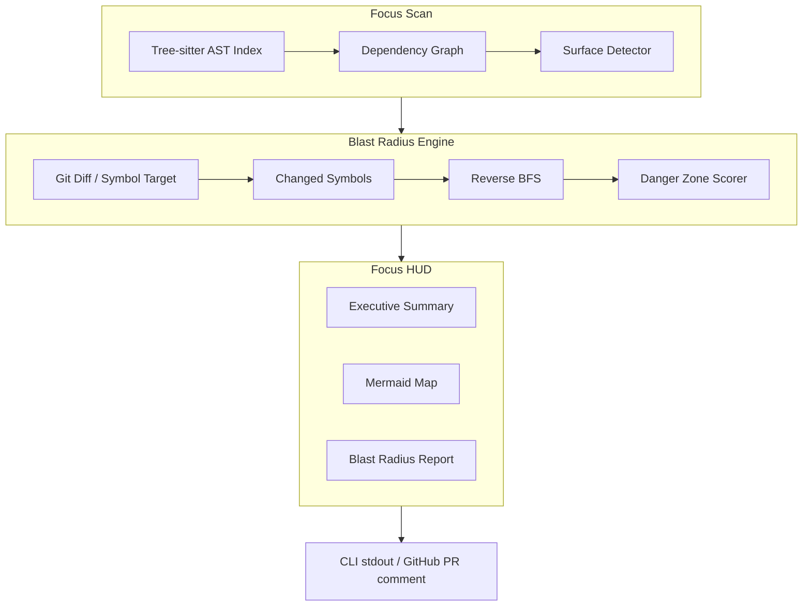

# Focus

Focus answers one question before you merge: **what else in this codebase could break because of this change?**

It's an **AR HUD for codebases**: it maps how the pieces of a repository connect — imports, calls, API routes, schemas — and shows the blast radius of a change before it merges.

> **Status:** Phase 1 in progress — CLI scaffold landed; parser, graph, and HUD are being built in the open. See [`docs/ROADMAP.md`](docs/ROADMAP.md).

---

## Why "Focus"?

The name comes from *Horizon Zero Dawn*. The game's world was built by a civilization that is long gone, and it runs on machines no one alive fully understands. Aloy can navigate it because of her **Focus** — a small AR device that scans that inherited world and reveals what the naked eye can't: machine weak points, hidden paths, danger ahead. Intel first, decisions second.

A legacy codebase is the same kind of world — built by people who have moved on, full of machinery nobody fully understands anymore. This Focus scans it and surfaces what a raw diff can't, so you make the change with intel instead of walking in blind.

In other words: Aloy is the junior engineer handed a legacy codebase. The Focus is how she reads it.

*Horizon Zero Dawn and Aloy belong to Guerrilla Games — no affiliation, just admiration.*

---

## Why this exists

AI coding assistants generate massive pull requests in seconds — and then those PRs sit, because reviewing them is the hard part. A standard text diff can't show *blast radius*: who imports this function, which API routes break, which schemas drift.

Existing tools dump 1,000-word summaries onto PRs. Focus replaces text walls with **evidence-based visual clarity**:

- **Focus Scan** — Tree-sitter parses the full repo and maps structural nodes (imports, calls, routes, schemas).
- **Blast Radius Engine** — Simulates ripple effects of a proposed change; highlights Danger Zones before merge.
- **Focus HUD** — Executive summary + Mermaid dependency map + bulleted blast radius report.

Passive enablement only: no blocking commits, no quizzing developers.

---

## Architecture



| Layer | Technology |
|---|---|
| CLI | Python 3.12+ / Typer |
| AST parsing | Tree-sitter (multi-language grammars) |
| Graph | NetworkX (dependency + blast radius traversal) |
| Diagrams | Mermaid.js (native GitHub rendering) |
| LLM | Off by default (`FOCUS_LLM_ENABLED=false`); optional labels only — topology is computed, not hallucinated |
| GitHub integration | GitHub Action on PR open/sync |

**Core pipeline:** Full-repo Tree-sitter index → dependency graph → diff/symbol seeds → reverse BFS blast radius → smart triggers (diagram vs summary) → Focus HUD.

See [`.cursor/rules/focus-engineering.mdc`](.cursor/rules/focus-engineering.mdc) for non-negotiable engineering constraints.

---

## Commands

| Command | Purpose | Status |
|---|---|---|
| `focus scan [path]` | Full-repo AST index + dependency map | 🟡 File discovery (`.gitignore`-aware) works today; AST index lands next |
| `focus trace [file]` | Trace what a file/symbol connects to | ⬜ Phase 1 |
| `focus audit [pr\|branch]` | Pre-merge blast radius for a PR or branch diff | ⬜ Phase 2 |
| `focus audit --local` | Pre-flight against working tree vs `main` | ⬜ Phase 2 |
| `focus version` | Print the installed version | ✅ |

---

## Roadmap (summary)

| Phase | Goal |
|---|---|
| **0** *(complete)* | Stack decisions, HUD schema, trigger rules, learning docs |
| **1** *(now)* | Python CLI: `focus scan` + `focus trace` on one language (Python) |
| **2** | Blast radius engine + `focus audit --local` + Mermaid HUD |
| **3** | JS/TS parsers, smart triggers, GitHub Action |

Full detail: [`docs/ROADMAP.md`](docs/ROADMAP.md)

---

## Getting started

> Phase 1 is in progress. `focus scan` currently discovers the files it will analyze (respecting `.gitignore`); the AST index, graph, and `trace` land as Phase 1 progresses.

```bash
git clone https://github.com/j0viane/focus.git
cd focus
uv sync            # or: pip install -e .
uv run focus --help
uv run focus scan .
```

Requirements: Python 3.12+, [`uv`](https://docs.astral.sh/uv/) (or `pip`). Tree-sitter grammars arrive with the parser in Phase 1.

Run the tests:

```bash
uv run pytest
```

---

## Ethics & privacy

- **Evidence-based** — graph topology is computed; an LLM (when enabled) only labels nodes, it never invents edges
- **Privacy-by-design** — respects `.gitignore`; secrets excluded; LLM receives structured graph JSON, not full source (Phase 3+)
- **No surveillance** — analyzes code structure, not developer identity or velocity
- **Opt-in GitHub Action** — minimum token scope; repos choose to install

| Document | Contents |
|---|---|
| [`docs/HUD.md`](docs/HUD.md) | Frozen HUD output schema (source of truth) |
| [`docs/STACK.md`](docs/STACK.md) | Locked technology choices |
| [`docs/DECISIONS.md`](docs/DECISIONS.md) | Phase 0 resolved questions |
| [`docs/ETHICS.md`](docs/ETHICS.md) | Responsible use, anti-weaponization, LLM ethics |
| [`docs/PRIVACY.md`](docs/PRIVACY.md) | Data boundaries, secrets, LLM payloads, Action permissions |
| [`docs/TRIGGERS.md`](docs/TRIGGERS.md) | Smart triggers — diagram vs pass-through |
| [`docs/TESTING.md`](docs/TESTING.md) | Testing pyramid, golden fixtures, CI constraints |

---

## License

[MIT](LICENSE)

---

## Author

Built by [Joviane Bellegarde](https://github.com/j0viane). Feedback and architecture review tips welcome via Issues.
