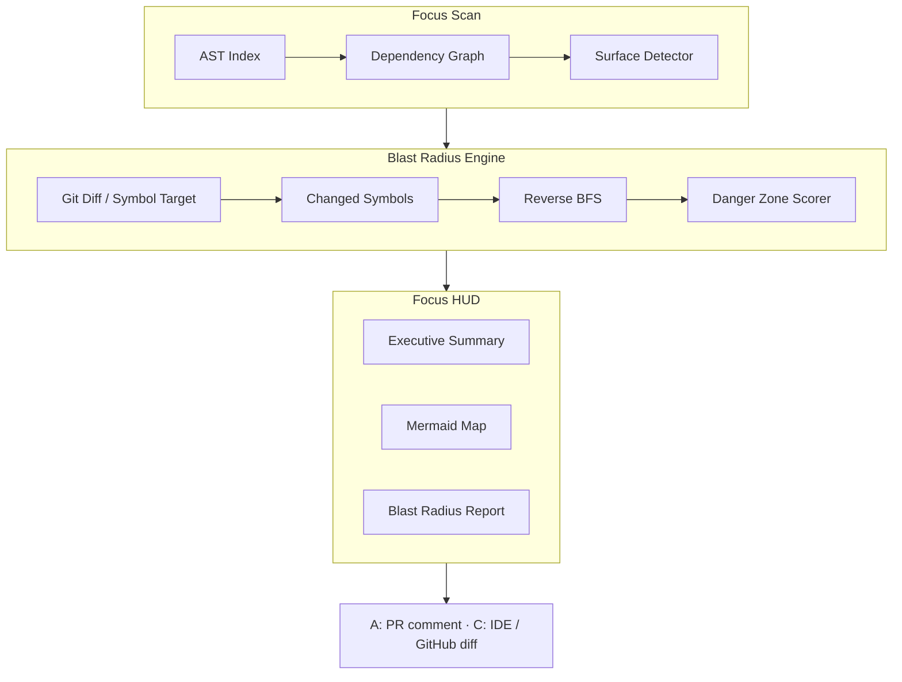

# Focus

**Blast radius you can defend — evidence-only, before you merge.**

When a senior asks *why* on an AI-assisted PR, “the model wrote it” isn’t an answer.  
Focus shows **what else that change touches** — with evidence you can point at in review.

---

## Who · What · When · Where · Why · How

| | |
|---|---|
| **Who** | Juniors shipping AI-assisted PRs, and seniors who have to review them — anyone who must **defend** a change |
| **What** | An evidence-only blast-radius HUD: import graph → Mermaid map + Danger Zones. No LLM inventing edges |
| **When** | Right before you push, and on every PR — the moment someone asks “what else breaks?” or “why this?” |
| **Where** | **A:** GitHub PR comment (full HUD). **C:** inline in the diff — IDE CodeLens + HUD panel now; GitHub file annotations next. **Not** committed `.md` files |
| **Why** | AI made teams faster at generating code and slower at shared understanding. The feedback loop breaks when the answer is silence |
| **How** | Parse the repo → dependency graph → reverse-BFS from the diff → quiet unless it matters. Same `FocusHUD` everywhere (`--format json` for the IDE) |

> Not another AI PR summary. Not a hop inventory that cries wolf on every file.

---

## Try in 60 seconds

```bash
pip install "focus-hud>=0.3.0"
# or: uv tool install focus-hud

focus trace path/to/shared_module.py --out focus-hud.md
# open focus-hud.md → Markdown preview for Mermaid

focus audit --local --out focus-hud.md   # local preview only (gitignored — not committed)
focus audit --local --format json        # machine-readable HUD (IDE / tools)
```

`focus-hud.md` is a **scratch file** for local Mermaid preview. Focus does **not** ask you to commit HUD output — reviewers get **A** (PR comment) and **C** (inline in the diff).

**Demo fixture (no app required):**

```bash
git clone https://github.com/j0viane/focus.git && cd focus
uv sync
uv run focus trace tests/fixtures/glass_box/auth_utils.py \
  --root tests/fixtures/glass_box --out focus-hud.md
```

Gallery + walkthrough: [`docs/DEMO.md`](docs/DEMO.md) · [`docs/assets/`](docs/assets/)

---

## Where Focus shows up

| Surface | When | What you get |
|---|---|---|
| **A — PR comment** | Every PR (GitHub Action) | Full architecture HUD — summary, Mermaid, Danger Zones. Updates in place on new pushes |
| **C — IDE diff** | Before you push (Cursor / VS Code) | CodeLens on changed + blast-radius files; click for HUD panel |
| **C — GitHub diff** | PR review (planned) | Inline pins on **Files changed** — companion to the PR comment |
| ~~**B — git**~~ | — | **Not supported** — no committed `focus-hud.md` |

Same evidence everywhere: parse → graph → `FocusHUD` → renderer (markdown comment, webview, CodeLens, future GitHub annotations).

---

## In Cursor / VS Code (diff-first · surface C)

CodeLens on changed symbols + per-hunk explainers + click for the full HUD panel — blast radius **in the diff you're editing**.

**What it looks like on a changed function** (virtual UI — nothing written to git):

```text
🎯 Focus · _extract_definitions · 🔴 CRITICAL · 22 downstream
   Part of a CRITICAL blast radius — 22 downstream files may be affected.

    def _extract_definitions(tree: ast.AST) -> list[Definition]:
        definitions: list[Definition] = []
        for node in ast.walk(tree):
            if isinstance(node, (ast.FunctionDef, ast.AsyncFunctionDef)):
                ℹ️ Records this as a function in the AST (Abstract Syntax Tree).
                definitions.append(
                    Definition(
                        name=node.name,
                        kind="function",
                        line=node.lineno,
                        docstring=_first_docstring_line(node),
                    )
                )
            elif isinstance(node, ast.ClassDef):
                ℹ️ Records this as a class in the AST (Abstract Syntax Tree).
                definitions.append(
                    Definition(
                        name=node.name,
                        kind="class",
                        line=node.lineno,
                        docstring=_first_docstring_line(node),
                    )
                )
```

| Row | Where | What |
|---|---|---|
| 🎯 Focus header | Above `def` / `class` | Symbol name, risk tier, downstream count + short summary |
| ℹ️ Detail | Above each edit block | Hunk-local plain English (acronyms expanded for juniors) |

```bash
pip install "focus-hud>=0.3.0"
./scripts/install-extension.sh   # or: cd extensions/vscode-focus && npm run compile
```

Then open your repo, set `focus.path` if needed, and run **Focus: Audit Local Changes**. Details: [`extensions/vscode-focus/README.md`](extensions/vscode-focus/README.md).

| Moment | Command | You get |
|---|---|---|
| AI rewrote a shared function | `focus audit --local` or **Focus: Audit Local Changes** | **C** — blast radius in your working diff |
| Big PR in your queue | Focus Action comment | **A** — diagram + Danger Zones on the PR |
| Inherited a module | `focus trace path/to/file.py` | Downstream map for one file |

---

## GitHub Action (surface A · any repo)

Copy [`examples/focus-action.yml`](examples/focus-action.yml) → `.github/workflows/focus.yml`.  
On every PR open/sync, Focus posts (and updates) a HUD **comment** — not a file in the commit.

Details: [`docs/ACTION.md`](docs/ACTION.md). Permissions: `contents: read` + `pull-requests: write` only ([`docs/PRIVACY.md`](docs/PRIVACY.md)).

**Phase 5:** inline annotations on the PR diff (**C** on GitHub) — see [`docs/ROADMAP.md`](docs/ROADMAP.md).

---

## Getting started (from this repo)

```bash
git clone https://github.com/j0viane/focus.git
cd focus
uv sync
uv run focus scan .
uv run focus trace src/focus/models.py --out focus-hud.md
uv run focus audit --local
```

Unchanged files reuse **`.focus-cache/`** (gitignored). Pass `--no-cache` to force a full re-parse.

Optional: copy [`.focus.toml.example`](.focus.toml.example) → `.focus.toml` to tune `fan_out_threshold` (default **3**).

Requirements: Python 3.12+. Install: **`pip install focus-hud`** (CLI: `focus`). Publish notes: [`docs/PUBLISH.md`](docs/PUBLISH.md).

```bash
uv run pytest
```

---

## Why "Focus"?

The name comes from *Horizon Zero Dawn*. Aloy navigates an inherited world with her **Focus** — an AR device that reveals weak points and danger ahead. A legacy codebase is the same kind of world. This Focus scans it so you change it with intel, not blind faith.

*Horizon Zero Dawn and Aloy belong to Guerrilla Games — no affiliation, just admiration.*

---

## Architecture



| Layer | Technology |
|---|---|
| CLI | Python 3.12+ / Typer (`--format markdown\|json`) |
| AST | Python `ast` + Tree-sitter (JS/TS) |
| Graph | NetworkX |
| Diagrams | Mermaid (GitHub + IDE webview) |
| CI | Opt-in GitHub Action — PR comment (A); inline diff (C) planned |
| IDE | VS Code / Cursor — CodeLens + HUD panel (C) |

---

## Commands

| Command | Purpose |
|---|---|
| `focus scan [path]` | Index the repo (Python + JS/TS) |
| `focus trace [file]` | HUD for one file (`--format json` for tools) |
| `focus audit --local` | Working tree vs `main` |
| `focus audit --base <sha>` | PR / branch range |
| `focus version` | Installed version |

---

## Roadmap

Phase 3 **complete**. Phase 4 **in progress** (IDE **C**). Phase 5 **next** (GitHub diff **C** + **A** comment). See [`docs/ROADMAP.md`](docs/ROADMAP.md).

---

## Ethics & privacy

- **Evidence-based** — no LLM inventing edges
- **Privacy-by-design** — respects `.gitignore`; no source to model APIs
- **No surveillance** — structure, not developer identity
- **Opt-in Action** — minimum token scope

| Doc | Contents |
|---|---|
| [`docs/DEMO.md`](docs/DEMO.md) | Walkthrough + gallery |
| [`docs/LAUNCH.md`](docs/LAUNCH.md) | Product Hunt / Show HN drafts |
| [`docs/ACTION.md`](docs/ACTION.md) | Action install |
| [`docs/HUD.md`](docs/HUD.md) | HUD schema + JSON contract |
| [`docs/ETHICS.md`](docs/ETHICS.md) | Responsible use |
| [`docs/PRIVACY.md`](docs/PRIVACY.md) | Data boundaries |

---

## License

[MIT](LICENSE) © 2026 Joviane Bellegarde.

## Author

[Joviane Bellegarde](https://github.com/j0viane). Feedback welcome via Issues.
