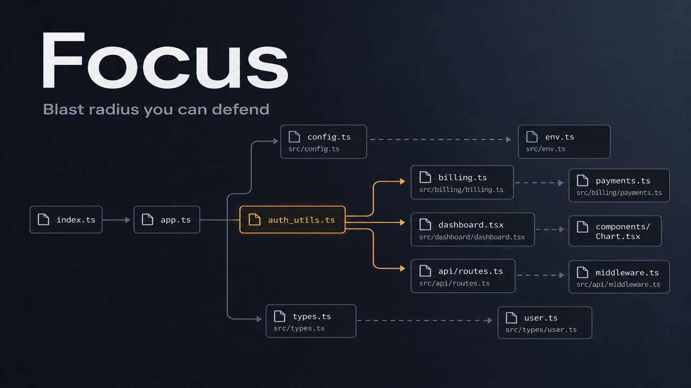
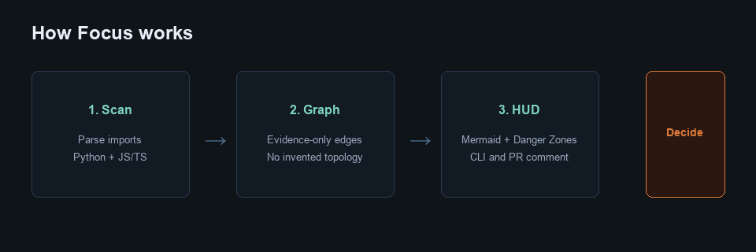
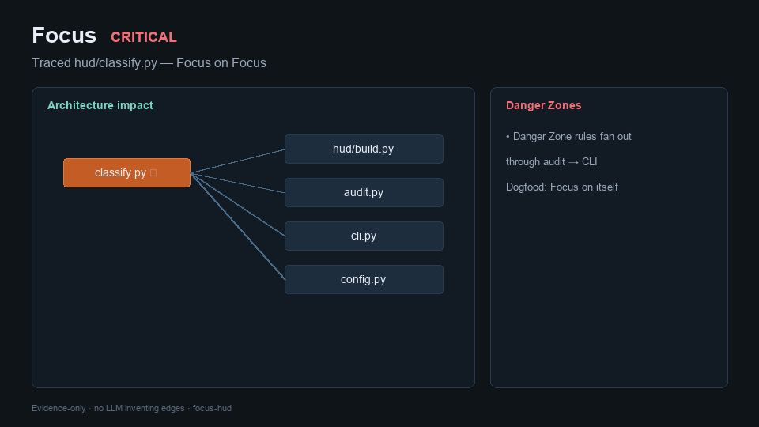
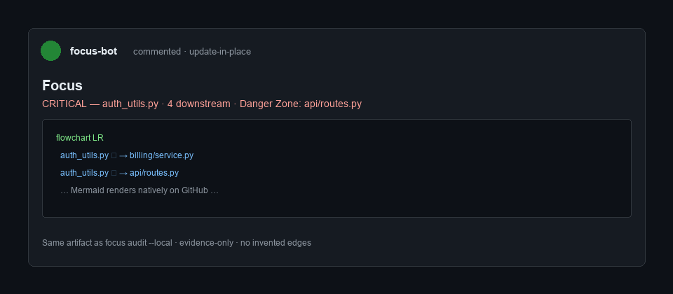
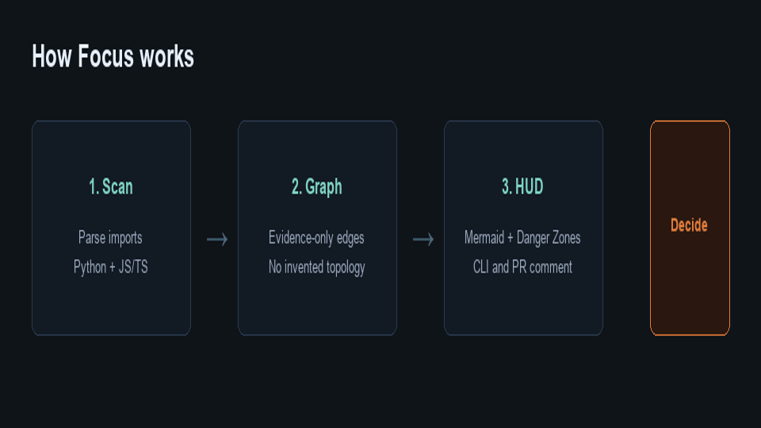

# Focus demo (portfolio walkthrough)

**Tagline:** Blast radius you can defend — evidence-only, before you merge.

Evidence-only blast radius — no LLM. These HUDs were generated with the shipped CLI.

## Gallery

| Asset | File |
|---|---|
| Hero |  |
| How it works |  |
| Glass-box HUD |  |
| Focus-on-Focus |  |
| PR comment |  |
| Demo loop (GIF) |  |

Vector sources (editable): `assets/*.svg`.

---

## Try in 60 seconds

```bash
pip install focus-hud
focus audit --local --out focus-hud.md
# open focus-hud.md → Markdown preview
```

Or from this repo:

```bash
uv sync
uv run focus trace tests/fixtures/glass_box/auth_utils.py \
  --root tests/fixtures/glass_box --out focus-hud.md
```

---

## 1. Golden fixture (Python) — shared auth hub

```bash
uv run focus trace tests/fixtures/glass_box/auth_utils.py \
  --root tests/fixtures/glass_box \
  --out docs/examples/focus-hud-glass-box.md
```

**What you should see:** **CRITICAL** — 4 downstream files, up to 2 hops. Danger Zone: `api/routes.py`.

Full HUD: [`examples/focus-hud-glass-box.md`](examples/focus-hud-glass-box.md).

## 2. Same shape in TypeScript

```bash
uv run focus trace tests/fixtures/glass_box_js/authUtils.ts \
  --root tests/fixtures/glass_box_js \
  --out docs/examples/focus-hud-glass-box-js.md
```

Full HUD: [`examples/focus-hud-glass-box-js.md`](examples/focus-hud-glass-box-js.md).

## 3. Dogfood — Focus on Focus

```bash
uv run focus trace src/focus/hud/classify.py --root . \
  --out docs/examples/focus-hud-classify.md
```

Full HUD: [`examples/focus-hud-classify.md`](examples/focus-hud-classify.md).

## 4. PR comment (live)

This repo’s Action posts (and **updates in place**) a Focus HUD on pull requests. Example PRs: [#2](https://github.com/j0viane/focus/pull/2), [#4](https://github.com/j0viane/focus/pull/4), [#5](https://github.com/j0viane/focus/pull/5).

Drop-in for any repo: [`../examples/focus-action.yml`](../examples/focus-action.yml) · [`ACTION.md`](ACTION.md).

**Interview / PH one-liner:** Focus answers “what else could break?” with a computed import graph — CLI locally, same HUD on the PR, no model inventing edges.
