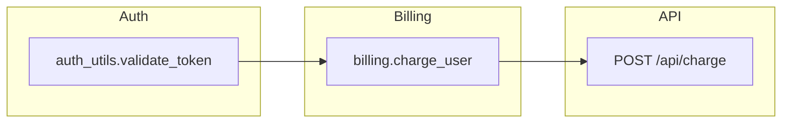

# Focus — HUD Schema (Frozen)

Canonical output contract for CLI stdout, PR comments, and example output. **Do not change without updating tests and `focus.mdc`.**

**Last updated:** July 2026  
**Status:** Frozen for Phase 1

---

## Modes

| Mode | When | Blocks |
|---|---|---|
| **Full HUD** | Smart trigger → diagram | All 4 blocks below |
| **Pass-through** | Low-impact change | Block 1 only (1 sentence) |
| **Error** | Parse failure, empty graph | Block 1 + optional Block 4 caveat |

---

## Block 1 — Executive Summary

**Required:** always  
**Max length:** 2 sentences

Must include:
- What changed (seed symbols or files)
- Risk tier: `LOW` | `MEDIUM` | `HIGH` | `CRITICAL`

**Example (full HUD):**

> Modified `validate_token` in `auth_utils.py`. **HIGH** risk — shared auth utility with downstream API and billing dependencies.

**Example (pass-through):**

> **Focus:** Updated `docs/README.md` only — no executable code dependencies detected. **LOW** risk.

---

## Block 2 — Visual Dependency Map

**Required:** full HUD only  
**Format:** Mermaid fenced code block (`flowchart LR` or `flowchart TB`)

Rules:
- Max **15 nodes**; collapse by package/layer when exceeded
- Every edge must exist in computed graph JSON
- Node IDs = symbol or module paths (LLM may add human label in node text)
- Use `subgraph` for layers (e.g., auth, billing, api)

**Example:**



---

## Block 3 — Blast Radius Report

**Required:** full HUD only  
**Format:** bulleted list with tier emojis

```markdown
🔴 **Danger Zones**
- `POST /api/charge` — API route in blast radius (2 hops from seed)
- `billing.charge_user` — high fan-out consumer

🟡 **Impacted Downstream**
- `dashboard.views.render` ← `auth_utils.validate_token` (3 hops)

🟢 **Isolated / Low Risk**
- (none for this change)
```

Tier rules: see [`TRIGGERS.md`](TRIGGERS.md) and [`ETHICS.md`](ETHICS.md).

---

## Block 4 — Analysis Caveat

**Required:** when static analysis coverage is partial  
**Optional:** omit when confidence is full

Default text (frozen):

> **Caveat:** Static analysis only. Runtime imports, dynamic dispatch, and cross-repo dependencies may not appear in this graph.

Append specific blindspots when detected (e.g., `importlib`, `eval`, star imports).

---

## Machine-readable schema (Pydantic + CLI JSON)

Implemented as `FocusHUD` in `src/focus/models.py`. CLI:

```bash
focus trace path/to/file.py --format json
focus audit --local --format json
```

Emits `FocusHUD.model_dump(mode="json")` — the VS Code / Cursor extension consumes this (do not scrape markdown).

| Field | Type | Notes |
|---|---|---|
| `mode` | `full` \| `pass_through` \| `error` | Smart-trigger outcome |
| `seed` | string | Primary file / symbol seed |
| `summary` | string | Block 1 |
| `risk_tier` | `LOW` \| `MEDIUM` \| `HIGH` \| `CRITICAL` | |
| `mermaid` | string \| null | Block 2 source |
| `danger_zones` | `ImpactNode[]` | path, hops, reason |
| `downstream` | `ImpactNode[]` | |
| `isolated` | string[] | |
| `changed_symbols` | `ChangedSymbolInfo[]` | audit only |
| `caveat` | string \| null | Block 4 |

---

## Pass-through template

No blocks 2–4. Single line or short paragraph:

```markdown
**Focus:** {one sentence}. **{RISK_TIER}** risk.
```

---

## PR comment wrapper

```markdown
## Focus

{Block 1}

<!-- full HUD only -->
### Architecture impact
{Block 2 mermaid fence}

### Blast radius
{Block 3}

{Block 4 if present}

---
<sub>Generated by Focus · [docs](https://github.com/j0viane/focus)</sub>
```

---

## Related documents

- [`TRIGGERS.md`](TRIGGERS.md) — full vs pass-through
- [`TESTING.md`](TESTING.md) — golden expected HUD strings
- [`PRIVACY.md`](PRIVACY.md) — what never appears in HUD (secrets)
