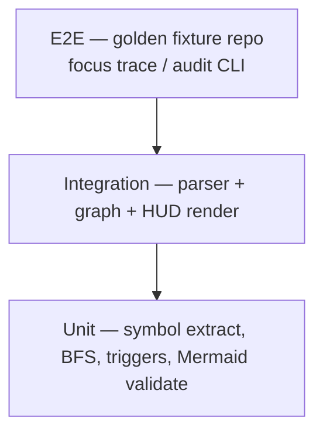

# Focus — Testing Strategy

Living document. Defines how Focus is tested without exposing private code or secrets.

**Last updated:** July 2026  
**Status:** Phase 0 — pyramid locked before application code

---

## North star

**Prove the graph pipeline on fixtures you control.** Golden repos with known dependency shapes — not random open-source clones with unknown edge cases in CI.

---

## Testing pyramid



| Layer | What | Runs in CI? |
|---|---|---|
| **Unit** | Tree-sitter query output, edge builder, trigger evaluator, Mermaid validator | ✅ Always |
| **Integration** | Parse fixture dir → graph → blast radius → HUD string | ✅ Always |
| **E2E** | Full CLI against `tests/fixtures/glass_box/` golden repo | ✅ Always |
| **Live repo manual** | Run against GhostAgent or personal project locally | ❌ Manual only |
| **Live GitHub Action** | PR comment on test repo | ❌ Manual / scheduled |

---

## Fixture strategy

### Golden repo: `tests/fixtures/glass_box/`

Minimal Python layout proving blast radius:

```
glass_box/
├── auth_utils.py      # validate_token()
├── billing/service.py # imports auth_utils
├── api/routes.py      # POST /charge → billing
└── dashboard/views.py # imports auth_utils
```

**Golden assertions:**

- `focus trace auth_utils.py` → downstream includes billing, api, dashboard
- `focus audit` (change to `validate_token`) → Danger Zone: API route
- README-only change → pass-through, no diagram

### Synthetic data only in CI

| Allowed in CI | Never in CI |
|---|---|
| Fixture Python files (fake names) | Real API keys in fixtures |
| Mock git diffs (patch files) | Cloned private repos |
| Mock LLM responses (JSON fixtures) | Live LLM API calls (Phase 1) |
| Static Mermaid expected output | User `.env` files |

---

## Test categories

### Parser tests

- Import extraction: absolute, relative, `from x import y`
- Call site resolution: same-file, cross-file (best effort)
- Edge cases: `if TYPE_CHECKING`, star imports (document as limitation)

### Graph tests

- Reverse BFS hop count
- Cycle handling (don't infinite loop)
- Empty graph / orphan file

### Trigger tests

- Table-driven: `(file_paths, diff, expected: diagram|pass)`
- See [`TRIGGERS.md`](TRIGGERS.md) for rule coverage

### HUD / Mermaid tests

- Every edge in Mermaid exists in graph JSON
- Node count cap enforced
- Invalid Mermaid → fallback to bullet list

### Privacy tests (Phase 2+)

- `.env` in fixture repo is **not** parsed or sent to mock LLM
- Secret-like strings in diff trigger LLM abort

---

## Manual testing checklist (pre-release)

- [ ] `focus scan .` on fixture repo completes < 30s
- [ ] `focus trace` HUD matches expected downstream set
- [ ] `focus audit --local` on branch with auth change → diagram
- [ ] Markdown-only branch → pass-through
- [ ] No secrets in stdout at `-v` verbose level

---

## Related documents

- [`PRIVACY.md`](PRIVACY.md) — no real secrets in CI
- [`ROADMAP.md`](ROADMAP.md) — Phase 1 Week 4 golden test deliverable
- [`TRIGGERS.md`](TRIGGERS.md) — trigger table-driven tests
