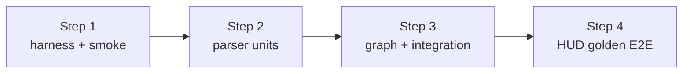
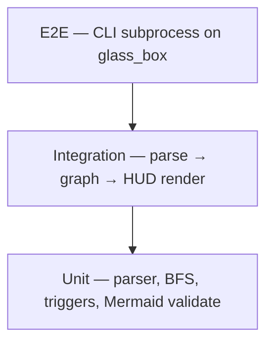

# Focus — Testing Strategy

Living document. Defines how Focus is tested without exposing private code or secrets.

**Last updated:** July 2026  
**Status:** Locked — tests grow with each Phase 1 step (not a Step 4 bolt-on)

---

## North star

**Prove the graph pipeline on fixtures you control.** Golden repos with known dependency shapes — not random open-source clones with unknown edge cases in CI.

**Testing philosophy:** `glass_box/` fixture lands **Step 1**; each feature step adds tests **with** the feature. Correctness is the product — untested graph logic is unacceptable.

---

## Phased rollout (Phase 1)

Tests accumulate step by step — not a single testing sprint at the end.

| Step | Test layer | What ships |
|---|---|---|
| **1** | Harness + smoke | `pytest` in `pyproject.toml`, `tests/fixtures/glass_box/` committed, `test_cli_smoke.py` |
| **2** | Parser unit | `test_parser.py` — imports, defs, call sites (`@pytest.mark.parametrize`) |
| **3** | Graph unit + integration | `test_graph.py`, `test_triggers.py`, first parse → graph integration test |
| **4** | HUD golden + E2E | `test_hud_golden.py`, Mermaid validator, subprocess CLI against fixture |



---

## Testing pyramid



| Layer | What | When | Runs in CI? |
|---|---|---|---|
| **Smoke** | CLI exits 0, `--help` works | Step 1 | ✅ |
| **Unit** | Pure functions: parser extract, BFS, triggers, validator | Steps 2–4 | ✅ |
| **Integration** | Parse fixture → graph → assert edges/downstream | Step 3+ | ✅ |
| **Golden / snapshot** | HUD string matches `HUD.md` structure | Step 4 | ✅ |
| **E2E** | `focus trace` subprocess on `glass_box/` | Step 4 | ✅ |
| **Live repo manual** | GhostAgent or personal project locally | Anytime | ❌ Manual |
| **Live GitHub Action** | PR comment on test repo | Phase 3 | ❌ Manual |

---

## Project layout

```
tests/
├── conftest.py                 # glass_box path fixture
├── fixtures/
│   └── glass_box/              # Step 1 — committed oracle repo
│       ├── auth_utils.py
│       ├── billing/service.py
│       ├── api/routes.py
│       └── dashboard/views.py
├── test_cli_smoke.py           # Step 1
├── test_parser.py              # Step 2
├── test_graph.py               # Step 3
├── test_triggers.py            # Step 3 — table-driven per TRIGGERS.md
└── test_hud_golden.py          # Step 4
```

---

## Test categories (by type)

### 1. Smoke tests (Step 1)

- `focus --help` exits 0
- `focus scan tests/fixtures/glass_box` finds expected `.py` files
- Respects `.gitignore` when scanning real project root

### 2. Unit tests (Steps 2–4) — bulk of the suite

| Target | Assert |
|---|---|
| Import extractor | `from billing import x` → correct module edge |
| Call resolver | `foo()` in file A → edge to definition of `foo` |
| Reverse BFS | Known 4-node graph → hop counts, downstream set |
| Smart triggers | Parametrize: `(paths, diff_patch) → diagram \| pass` |
| Mermaid validator | Edge in diagram not in graph JSON → fail |
| Pydantic HUD model | Invalid `risk_tier` → validation error |

**Trigger tests mirror [`TRIGGERS.md`](TRIGGERS.md)** — doc and code must not drift.

### 3. Integration tests (Step 3+)

Call Python functions directly (no subprocess):

```python
# parse glass_box → build graph
# assert auth_utils downstream includes billing, api, dashboard
```

### 4. Golden / structural tests (Step 4)

Prefer **structural assertions** over brittle full-string snapshots:

- Downstream node set matches expected
- Risk tier is `HIGH` or `CRITICAL` for auth change
- Mermaid fence present; edge count ≤ 15
- Optional: snapshot file for final HUD polish (update intentionally)

### 5. E2E CLI tests (Step 4)

```python
# subprocess: focus trace auth_utils.py --cwd glass_box
# assert returncode 0 and stdout contains Danger Zone
```

One happy path + one pass-through (README-only diff mock).

---

## Fixture strategy

### Golden repo: `tests/fixtures/glass_box/`

Minimal Python layout proving blast radius:

```
glass_box/
├── auth_utils.py      # validate_token()
├── billing/service.py # imports auth_utils
├── api/routes.py      # POST /charge → billing
└── dashboard/views.py # imports auth_utils
```

**Golden assertions (full suite by Step 4):**

- `focus trace auth_utils.py` → downstream includes billing, api, dashboard
- `focus audit` (change to `validate_token`) → Danger Zone: API route
- README-only change → pass-through, no diagram

**License:** MIT (see [`DECISIONS.md`](DECISIONS.md))

### Synthetic data only in CI

| Allowed in CI | Never in CI |
|---|---|
| Fixture Python files (fake names) | Real API keys in fixtures |
| Mock git diffs (patch files in `tests/fixtures/patches/`) | Cloned private repos |
| Mock LLM responses (JSON fixtures) | Live LLM API calls (Phase 1) |
| Static Mermaid expected output | User `.env` files |

---

## Explicitly defer (Phase 1)

| Type | Why |
|---|---|
| Live LLM API tests | Mock fixtures only; manual with real key |
| GitHub Action integration | Phase 3 |
| Real open-source repos in CI | Uncontrolled graph shape |
| Property-based (Hypothesis) | Optional Phase 2+ for BFS invariants |
| Coverage % gates | Meaningless until core logic exists |

### Privacy tests (Phase 2+)

- `.env` in fixture repo is **not** parsed or sent to mock LLM
- Secret-like strings in diff trigger LLM abort

---

## Manual testing checklist (pre-release)

- [ ] `focus scan .` on fixture repo completes < 30s
- [ ] `focus trace` HUD matches expected downstream set
- [ ] `focus audit --local` on branch with auth change → diagram
- [ ] Markdown-only branch → pass-through
- [ ] No secrets in stdout at `-v` verbose level

---

## Related documents

- [`PRIVACY.md`](PRIVACY.md) — no real secrets in CI
- [`ROADMAP.md`](ROADMAP.md) — step-by-step test deliverables
- [`TRIGGERS.md`](TRIGGERS.md) — trigger table-driven tests
- [`HUD.md`](HUD.md) — golden HUD structure
