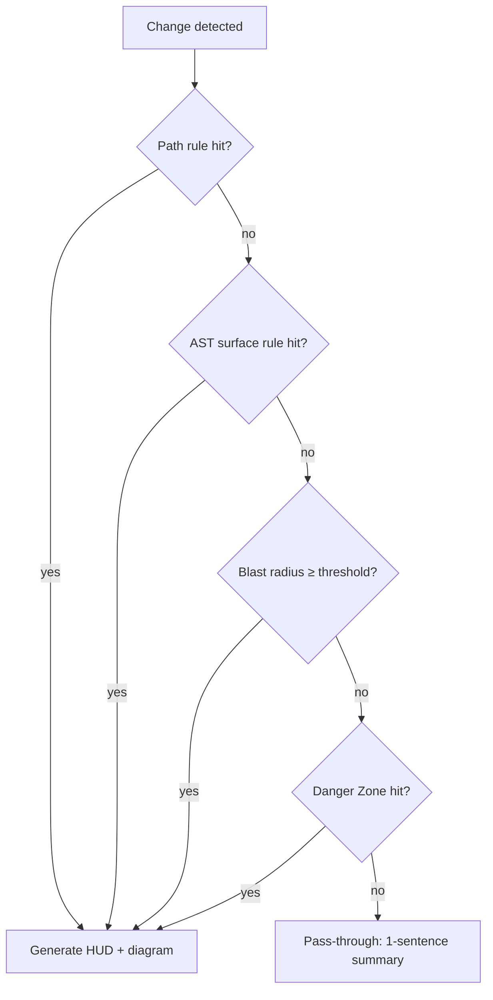

# Focus — Smart Triggers

Living document. Defines when Focus emits a full **Focus HUD** (with Mermaid diagram) vs a **pass-through summary** (one sentence, no diagram).

**Last updated:** July 2026  
**Status:** Phase 2 shipped; Phase 4b ROA extensions planned (tiny-diff → tiny output)

---

## Goal

Avoid **diagram fatigue**. Developers ignore tools that comment on every PR with a spaghetti chart. Focus generates diagrams only when structural impact warrants visual navigation.

**Default bias:** false negatives (skip diagram) over false positives (noisy diagram).

**Return on Attention (ROA):** every word Focus asks a human to read must earn its cost. Prefer silence or one sentence over filler. Never become the anti-pattern of a one-line diff with a novel-length summary.

---

## Decision flow



---

## Rule layers (evaluate in order)

### Layer 1 — Path rules → **Diagram**

| Pattern | Rationale |
|---|---|
| `**/migrations/**` | Schema change |
| `**/schema.prisma`, `**/models.py`, `**/models/**` | Data model |
| `**/routes/**`, `**/api/**`, `**/routers/**` | API surface |
| `package.json`, `package-lock.json`, `pnpm-lock.yaml` | Dependency manifest |
| `pyproject.toml`, `requirements.txt`, `poetry.lock` | Python deps |
| `**/settings.py`, `**/config.py`, `.env.example` | Global config (not `.env`) |
| `docker-compose.yml`, `Dockerfile` | Infrastructure coupling |

### Layer 2 — AST rules → **Diagram**

| Signal | Detection heuristic |
|---|---|
| New/changed route decorator | `@app.get`, `@router.post`, `app.route` |
| New/changed DB model field | ORM class body mutation |
| Changed public export | `__all__`, re-export in `__init__.py` |
| New/changed global/singleton | Module-level mutable state patterns |

### Layer 3 — Blast radius → **Diagram**

| Condition | Default threshold (Phase 2) |
|---|---|
| Downstream consumer count | ≥ 3 symbols or ≥ 2 files |
| Max hop depth to API/schema node | ≤ 3 hops from seed |
| Any seed symbol in shared `utils/`, `lib/`, `common/` | Always evaluate BFS |

### Layer 4 — Danger Zone → **Diagram**

If any downstream node matches Danger Zone tiers in [`ETHICS.md`](ETHICS.md) scoring (API route, schema, global state), generate diagram regardless of count.

---

## Pass-through rules → **Summary only**

All must be true:

| Condition | Example |
|---|---|
| Only markdown / docs | `README.md`, `docs/**` |
| CSS/token/color only | `*.css`, design tokens, Tailwind config colors |
| Comments-only diff | No executable logic change |
| Private function/class | Zero downstream importers in graph |
| Test-only files (optional) | `tests/**` with no production import path |

**Output format (pass-through):**

> **Focus:** Updated CSS variables in `theme.css` — no downstream code dependencies detected.

No Mermaid block.

---

## ROA extensions (Phase 4b — planned)

These sharpen triggers and copy caps so Focus stays high-signal when AI-era PR volume rises.

| Rule | Intent | Status |
|---|---|---|
| **Tiny diff + low blast radius → tiny output** | If changed lines are few *and* downstream count / Danger Zones are empty, force **pass-through** (or a one-line summary) — no Mermaid, no essay | Planned |
| **Output size ≤ impact** | Cap executive summary and inline ℹ️ length; one idea per lens; never restate the Focus header in the detail row | Planned |
| **Virtual UI only** | Explainers stay in CodeLens / HUD — never written into source or committed markdown | Done (protect) |

Wire into `should_emit_diagram` / pass-through paths and `expand_acronyms_for_juniors` / hunk detail emitters when implementing. Tests: parametrize `(tiny_diff, zero_downstream) → pass_through`.

---

## Config overrides (Phase 2+)

```yaml
# .focus.yml (planned)
triggers:
  downstream_threshold: 3
  always_diagram_paths:
    - "src/billing/**"
  never_diagram_paths:
    - "docs/**"
  force_diagram: false
```

---

## Tuning process

1. Run `focus audit --local` on 5–10 real PRs from a fixture or open-source repo
2. Label each: *should diagram* vs *should pass* (human judgment)
3. Adjust thresholds to maximize agreement
4. Document changes in this file

---

## Related documents

- [`ROADMAP.md`](ROADMAP.md) — Phase 2 deliverable
- [`docs/ETHICS.md`](ETHICS.md) — no false confidence from skipped diagrams
- [`.cursor/rules/focus-engineering.mdc`](../.cursor/rules/focus-engineering.mdc) — smart triggers engineering rule
