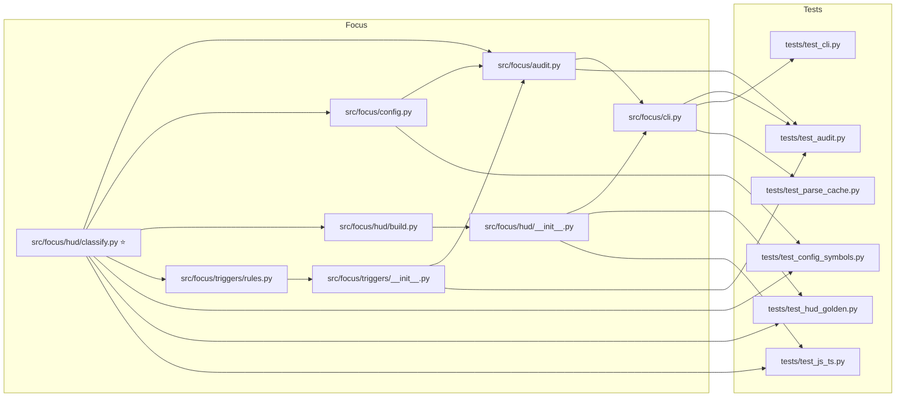

## Focus

Traced `src/focus/hud/classify.py`. **CRITICAL** risk — 13 downstream files, up to 3 hops away. Danger Zones: `src/focus/config.py`, `src/focus/cli.py`.

### Architecture impact

Legend: each box is a **file**; an arrow means **change flows to** (that file imports / depends on the previous one).

### Blast radius

🔴 **Danger Zones** *(risky if wrong — shared or API/schema/config)*
- `src/focus/config.py` — This is a config file — it directly imports a file you changed.
- `src/focus/cli.py` — Shared hub — imported directly by `tests/test_audit.py`, `tests/test_cli.py`, and `tests/test_parse_cache.py` — 2 import steps away from a file you changed.

🟡 **Also affected** *(these files depend on what you changed)*
- `src/focus/audit.py` — Directly imports `src/focus/hud/classify.py`.
- `src/focus/hud/build.py` — Directly imports `src/focus/hud/classify.py`.
- `src/focus/triggers/rules.py` — Directly imports `src/focus/hud/classify.py`.
- `tests/test_config_symbols.py` — Directly imports `src/focus/hud/classify.py`.
- `tests/test_hud_golden.py` — Directly imports `src/focus/hud/classify.py`.
- `tests/test_js_ts.py` — Directly imports `src/focus/hud/classify.py`.
- `src/focus/hud/__init__.py` — Depends on a file you changed through 2 import steps (not a direct import).
- `src/focus/triggers/__init__.py` — Depends on a file you changed through 2 import steps (not a direct import).
- `tests/test_audit.py` — Depends on a file you changed through 2 import steps (not a direct import).
- `tests/test_cli.py` — Depends on a file you changed through 3 import steps (not a direct import).
- `tests/test_parse_cache.py` — Depends on a file you changed through 3 import steps (not a direct import).

🟢 **Not pulled in** *(no dependents found for this change)*
- (none for this change)

**Caveat:** Static analysis only. Runtime imports, dynamic dispatch, and cross-repo dependencies may not appear in this graph.
