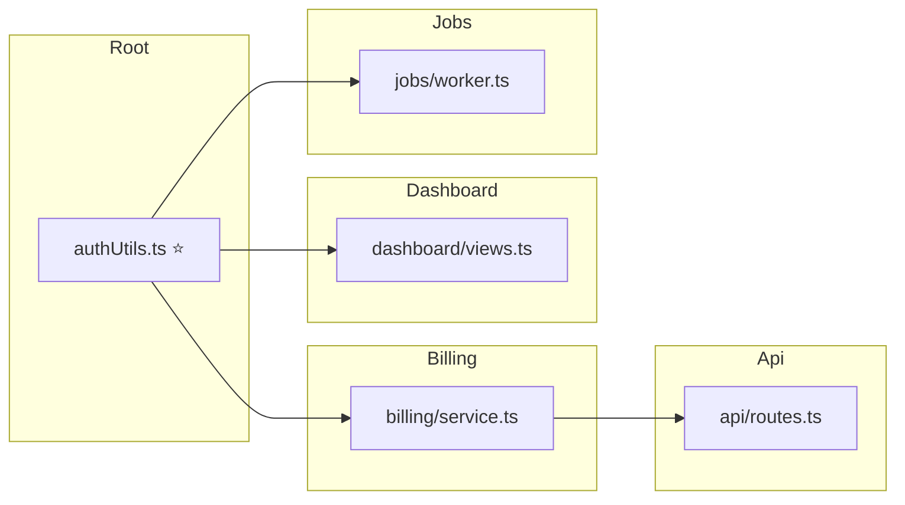

## Focus

Traced `authUtils.ts`. **CRITICAL** risk — 4 downstream files, up to 2 hops away. Danger Zones: `api/routes.ts`.

### Architecture impact

Legend: each box is a **file**; an arrow means **change flows to** (that file imports / depends on the previous one).

### Blast radius

🔴 **Danger Zones** *(risky if wrong — shared or API/schema/config)*
- `api/routes.ts` — This is an API route file — 2 import steps away from a file you changed.

🟡 **Also affected** *(these files depend on what you changed)*
- `billing/service.ts` — Directly imports `authUtils.ts`.
- `dashboard/views.ts` — Directly imports `authUtils.ts`.
- `jobs/worker.ts` — Directly imports `authUtils.ts`.

🟢 **Not pulled in** *(no dependents found for this change)*
- (none for this change)

**Caveat:** Static analysis only. Runtime imports, dynamic dispatch, and cross-repo dependencies may not appear in this graph.
